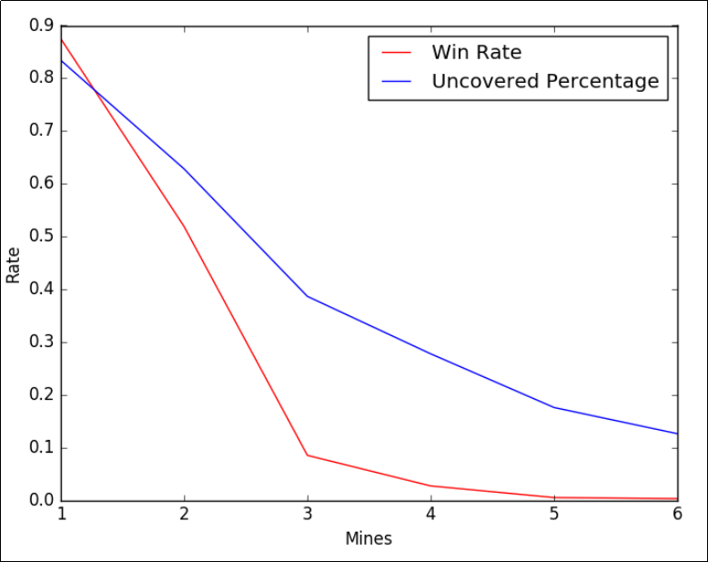
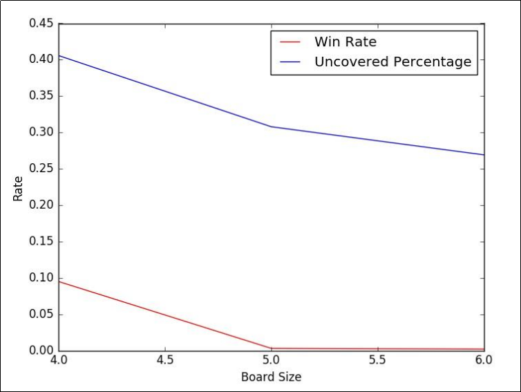
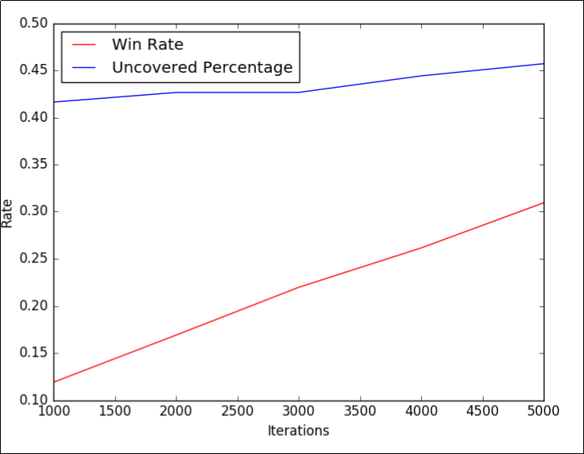

For our Q_learning algorithm, we consider revealing a tile as our action and existence of the bombs as the reward. If there is a bomb under the tile, we get -1 reward otherwise we get 1. Finally, our state is the state of the board at each moment.  
The factors which affect our problem are the number of mines, the size of the board, the number of iterations. In the blow, we show the effect of each factor on the win rate by drawing the related plot.

*Fig.1 Effect of mines' number on win rate.(board size = 4\*4, #iterations=1000)*

*Fig.2 Effect of board size on win rate.(#iterations=1000, #mines=3)*

*Fig.3 Effect of iterations' number on win rate.(board size = 4\*4 #mines=3)*